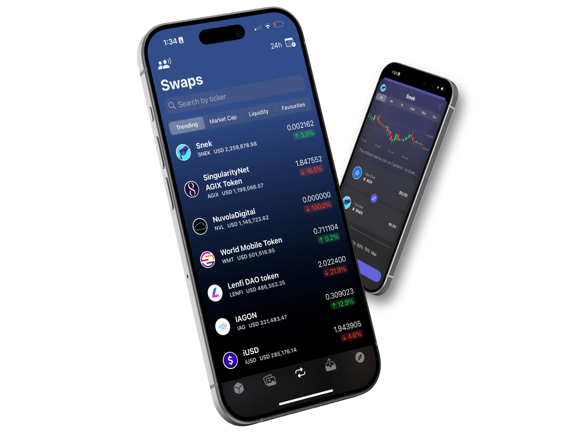

# **アセットの交換**

Tokeoの直感的なスワップ機能を使って、Cardanoやその他のブロックチェーン上で資産をスムーズに交換できます。モバイルデバイスから簡単に操作可能です。

Tokeoの革新的な機能を使用して、Cardano上での取引体験を最適化し、シームレスな資産のスワップを体験してください。

2タッチスワップ機能を使えば、ウォレット環境内で資産を簡単に交換でき、複数のステップが不要になります。

リアルタイムの価格とグローバルなオーダートラッキングを利用して、市場の動向を把握し、情報に基づいた取引決定ができます。

Tokeoは、ポートフォリオの価値を即座に認識し追跡できる機能を提供し、豊富な市場データとチャートで取引戦略を強化します。

### **2タッチスワップ**

ウォレット環境内で簡単に資産を交換し、ステップ数とプラットフォームを減らし、効率を向上させます。

### **リアルタイム価格**

リアルタイムの価格とグローバルオーダートラッキングにアクセスし、情報に基づいた取引が可能です。

### **ポートフォリオの追跡**

Tokeo内でポートフォリオをリアルタイムに追跡できます。

### **詳細なインサイト**

豊富な市場データとチャートを活用して、包括的な情報を得て取引戦略に役立てましょう。
