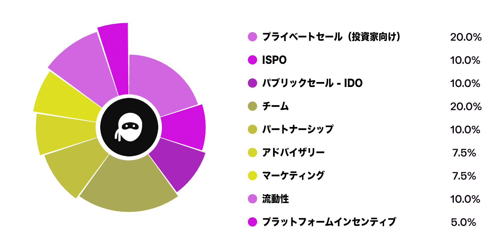

# **トークン配布**

## **トークン割り当て**

私たちは、投資家とトークン保有者に最大のリターンを確保することを優先し、1億のトークン総供給量を綿密に設計しました。

## **プライベートセール（投資家向け）**

Tokeoはプライベートセールを実施しており、Cardanoネイティブとさまざまなブロックチェーンネットワークからの投資家から大きな支持を受けています。この資金は、プラットフォームの最終開発とアプリの展開に充てられます。

パブリックセールでの15％の初期リリースに続いて、トークンは1ヶ月のクリフ期間を設けた上で、12ヶ月にわたって線形的にベスト（権利確定）されます。このアプローチは、利用可能な供給量を減少させ、投資家に継続的に価値を提供します。

## **ISPO**
投資家にTokeoの旅に参加するさらなる機会を提供するために、私たちはローンチ後にISPOをリリースする予定です。これには、Maestro ISPOスマートコントラクトとベスティングを利用し、投資家がパブリックセール時にトークンに変換される前にADAをステークできるようにします。

同様に、パブリックセールでの15％の初期リリースに続いて、トークンは1ヶ月のクリフ期間を設けた上で、12ヶ月にわたって線形的にベスト（権利確定）されます。これにより、投資家に継続的な価値を提供します。

## **パブリックセール**
Tokeoは2024年第4四半期にInitial DEX Offering (IDO) を通じてトークンオファリングを実施する予定です。これにより、早期投資家に流動性イベントと独占的な機会を提供します。

強力な予測収益と市場浸透を背景に、この取り組みは早期サポーターやトークン購入者にとって大きな価値を約束します。

さらにこの取り組みにより、トークンは分散型取引所 (DEX) で取引可能になり、ホルダーはTokeoに対する投資を継続するか、売却するかの柔軟性を得ることができます。

## **パートナーシップ**
すでに強固な戦略的提携ネットワークを基盤に、多くのパートナーがプロジェクトに投資していますが、Tokeoはトークン発行を活用し、これらの関係を強化することでさらなる可能性を提供する予定です。

私たちはパートナーの貢献を非常に重視しており、Tokeoの成功を促進する相互に有益な協力関係を育むことに専念しています。

## **アドバイザリー & マーケティング**
Tokeoは、Cardanoエコシステム内および広範な暗号コミュニティにおける著名なアドバイザー、マーケティングスペシャリスト、およびキーオピニオンリーダー（KOL）との関係を確立しています。

これらのコラボレーターは、Tokeoと積極的に関わり、アプリとプラットフォームの認知度を高めユーザー間での採用を促進しています。

割り当てプールからのトークンは、プロジェクトの成功に貢献するこれらのアドバイザーや影響力のある人物に報酬として利用されます。

## **流動性**
Tokeoはパブリックセール時に流動性を強化し、シームレスな取引を促進することでスリッページを最小限に抑えることを目指しています。私たちの目標は、トレーダーがポジションを容易に出入りできるようにすることです。

この流動性プールは、価格安定を促進し、ボラティリティを軽減し、スプレッドを縮小し、全体的な取引のコスト効率を向上させる上で重要な役割を果たします。

さらに、Tokeoは総収益の一部を利用してトークンを再購入し、バーンすることで流動性をさらに高め、トークンホルダーに継続的な取引活動に対する信頼を与えます。

このアプローチにより、Tokeoは健全な取引ダイナミクスを支える十分な取引量を維持し、トークンホルダーが安心して売却や再投資を行えるようにします。

## **プラットフォームインセンティブ**
Tokeoの戦略は、ユーザーがプラットフォームと積極的に関わるようにインセンティブを提供することに中心を置いています。綿密に設計された報酬システムを通じて、ユーザーはTokeoのサービスに対する忠誠心と頻繁な利用を促されます。

$TOKEトークンを活用することで、ホルダーは独占的な機能へのアクセス、手数料の割引、さまざまなインセンティブへの参加などの特典を享受できます。

このアプローチは、ユーザーエクスペリエンスを向上させるだけでなく、プラットフォームの活動が増加することでユーザーに具体的な報酬がもたらされる活気あるエコシステムを育成します。