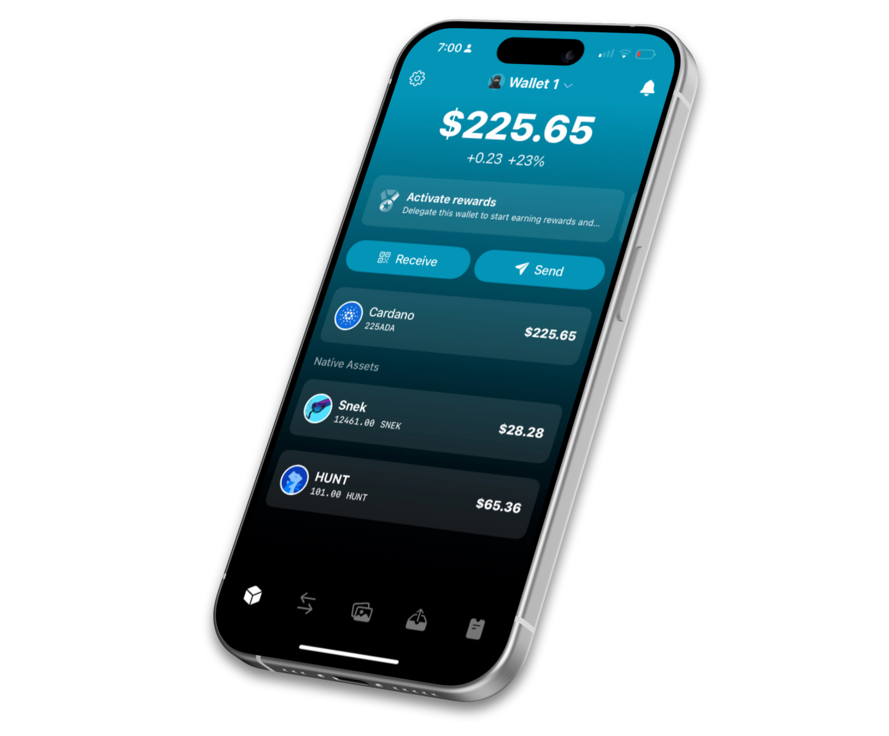

# **TOKEO**

!!! info "当ページについて"
    [TOKEO公式](https://tokeopay.io/)からの依頼によって、日本語翻訳ページを作成しました。 作成者:[BTBF](https://x.com/btbfpark)

Tokeoは、Cardanoや他のブロックチェーンに対応した次世代スマートモバイルウォレットです。安全性と信頼性が高く、機能が豊富に揃っています。

Tokeoは、直感的で使いやすいモバイルアプリを通じて、取引体験を向上させることに注力しています。送受信がスムーズでスタイリッシュに行えるだけでなく、ネイティブトークンの交換、NFTの操作、オンチェーンでの支払い請求書の送信なども一つのアプリで可能です。

最初はCardanoから対応し、その後すぐにBitcoinやEVMベースのチェーンとシームレスに連携するクロスチェーン機能を提供します。

## **Cardano向けウォレット体験の再定義**

### **ユーザー体験の向上**

Tokeoは、豊富なパーソナライズオプションとスマートなプッシュ通知機能でユーザー体験を革新します。Cardanoユーザーにシームレスなアクセスとエンゲージメントを提供するモバイルファーストのアプローチを採用しています。

### **独自の機能**

Tokeoは、モバイルデバイスでの取引体験を一新する画期的な機能を提供します。また、新しいユーザーのオンボーディングプロセスを簡素化し、直感的かつセキュリティを犠牲にせずに実現します。私たちは次世代のユーザーをスムーズに導入しながら、Cardanoエコシステムを育成します。Tokeoでは、アプリ内でネイティブトークンのスワップやコレクティブルの取引が可能です。

### **信頼性と信頼**

Tokeoは最高のセキュリティ基準を守り、ISO 27001情報セキュリティ基準に準拠して構築されています。将来的には監査を行い、さらに信頼性と透明性を強化します。今後数ヶ月でプラットフォームをオープンソース化し、分散化の理念を守ります。このアプローチにより、TokeoはCardanoやクロスチェーンユーザーにとって最も信頼できる安全なウォレットになります。さらに、戦略的なマーケティングやパートナーシップを通じて採用を促進します。
