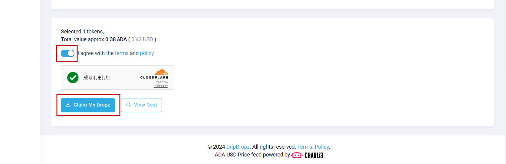

# **報酬請求**

ISPO報酬は[権利確定スケジュール](../tokenomics/vesting.md#ispo)※に基づいて[DripDropz](https://dripdropz.io/)にて請求手続きを実施してください。  

### TOKEOプール委任の場合
* 初回15%(2024年11月30日開始)、2025年1月23日から12ヶ月にわたり毎月7.08%づつ引き出し可能
* 未請求分はDripDropzに蓄積され、合算請求可能

### パートナープール委任の場合
* 初回15%(2025年1月16日開始)、2025年2月6日から12ヶ月にわたり毎月7.08%づつ引き出し可能
* 未請求分はDripDropzに蓄積され、合算請求可能
* 対象プールティッカー一覧は[こちら](./partner-spos.md)

各報酬の請求最終期限は現在確認中です。

## DripDropz請求手順

1. [DripDropz](https://dripdropz.io/)にアクセスし、ISPO報酬対象ウォレットのアドレスを入力し「Check My Dropz」をクリックしてください。  
*入力アドレスは、受信アドレス/ステーキングアドレス/$handleが有効です

2. 請求対象のトークンにチェックしてください。  この画面では $TOKEのみを選択していますが、他に欲しいトークンにチェックすることで一緒に請求することが可能です。

3. 下部までスクロールし、利用規約のトグルボタンを有効にして「Claim My Dropz」をクリックしてください。

4. 表示されたアドレスに対して、表示されたADA(この例では3ADA)を送金してください。  
※Eternl/Lace/Typhon/Nufiご利用の場合は、dApp接続形式でも請求可能です。  
※送金に使用するウォレットは1で確認した同一ウォレットから送金してください。
 

5. トランザクション承認と同時に請求したトークンがドロップされます
