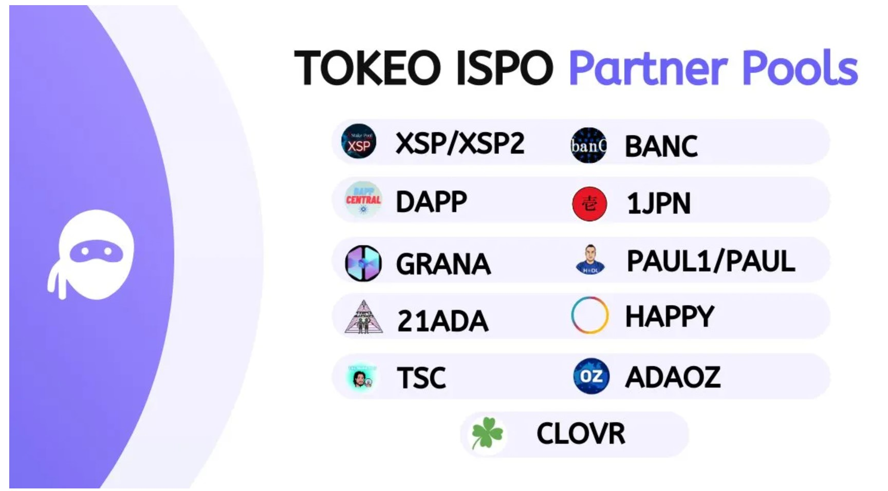

# **パートナーSPO（ステークプールオペレーター）**

## **パートナーシップの強化**
私たちは、**ステークプールオペレーター（SPO）間のコラボレーションと相互サポート**を促進する新しいパートナーシップモデルを発表できることを大変うれしく思います。**エポック490**から、パートナーSPOは以下の比率でTOKEを獲得します：
- **0.0045 x 4% = 0.00018 TOKE / ADAステーク**

この**公平で透明なアプローチ**により、各パートナープールがTOKEOエコシステムへの貢献から平等に利益を得られるようにします。

## **Cardanoコミュニティの強化**
私たちのパートナーシップは、協力することでより強固で相互接続されたコミュニティを築くという信念に基づいています。**SPOとの提携**を通じて、TOKEトークンの普及を拡大し、より分散化された公平なブロックチェーン環境を促進します。

この協力的な取り組みにより、成長の恩恵を共有し、活気に満ちたエンゲージメントの高いコミュニティを育成し、Cardanoエコシステム全体の強化に貢献します。

## **仕組みの詳細**：
- **0.0045 x 4% = 0.00018 TOKE / ADAステーク**の比率に基づき、パートナープール内の委任者に配布されるTOKEが予約されます。
- 各委任者の配分は、**委任されたADAの総量**に対する自身のステーク量に基づいて計算されます。

この**明確で透明なアプローチ**により、公平かつ比例した報酬配分を実現し、公正さとオープンさを重視する姿勢を反映しています。

## **追加ボーナスのお知らせ**
また、以前に発表したように、**パートナーSPOの委任者がTOKEOウォレットをダウンロードし、ウォレットからメインのTOKEO ISPOプールにステークする際のボーナス**も準備しています。今後の詳細にご期待ください。

**パートナーSPO**：
