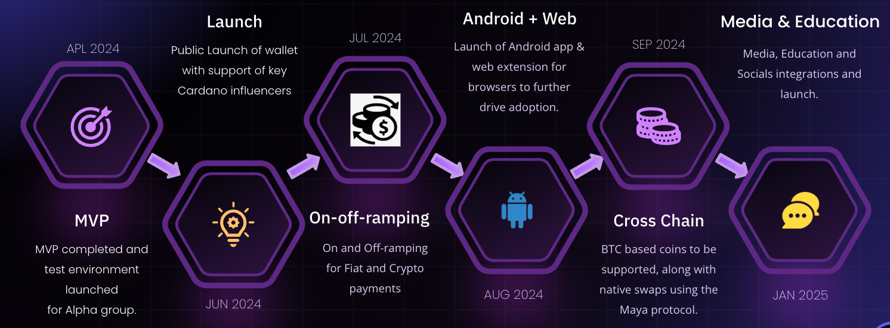

# **ロードマップ**

Tokeoのロードマップの旅をお楽しみください。2023年11月の構想から始まり、クロスチェーントレーディング、Androidおよびウェブ統合、フィアット通貨のオン／オフランピングなどの今後のマイルストーンが含まれます。

Tokeoのロードマップは、分散型金融の領域での革新と進展の物語を展開します。

2023年11月に構想され、プロジェクトは迅速に進行し、2024年3月に最低限の実用的製品（MVP）に到達しました。

2024年5月の公式リリースは重要なマイルストーンであり、6月にはAndroidおよびウェブプラットフォームへの拡大により、さまざまなデバイスでのアクセスが向上します。

さらに、フィアット通貨のオン／オフランピング機能の統合により、従来の通貨とデジタル通貨の移行がスムーズになり、Tokeoのユーザーベースと利便性がさらに広がります。

将来を見据え、Tokeoは2024年7月までにクロスチェーントレーディングと相互運用性を推進し、ブロックチェーンエコシステム内での流動性と接続性を高めることを目指しています。
