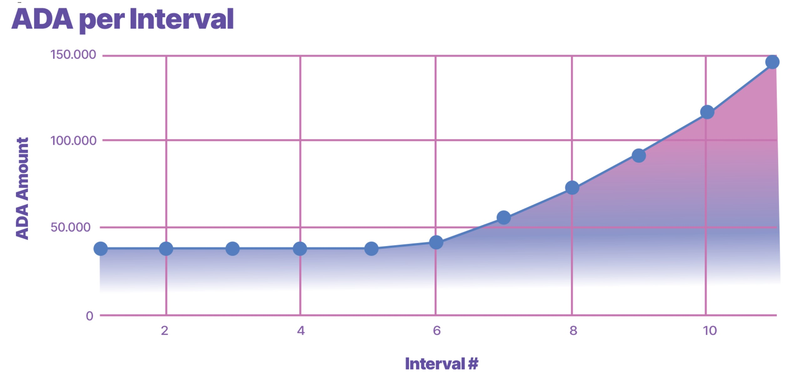
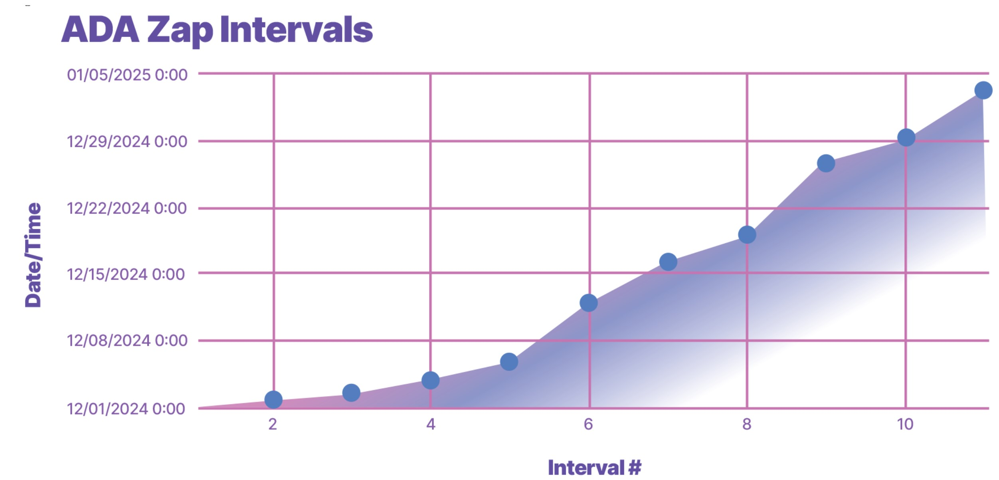

# **流動性供給戦略**

$TOKE の健全で堅牢な取引環境を確保するため、包括的な流動性提供戦略を設計しました。

### 初期流動性の割り当て

- 調達したADAのうち**15%**を流動性運用に充て、**5%**の$TOKEトークンを初期流動性に割り当てます。

## 初期流動性プール

- **200-300k ADA**（15%の割り当て分）と、**5%のトークン**を組み合わせ、Minswap上で初期流動性プールを立ち上げます。このプールでは標準的な1%の買い・売り手数料が適用されます。具体的なシード額は、IDOの最低および最大調達額に線形で対応し、需要に応じて調整されます。

## 流動性運用
- 残りの流動性割り当てには**ランダムなzap-inスケジュール**を採用します。この方法は以下の目的で設計されています：

  - プロジェクトへの投資コミットメントを示す
  - 健全なボラティリティを維持し、長期的な成長を促進
  - 買い戻しプログラムを通じて流動性プールの深さを増加
  - ランダム性を導入することで、マーケットアクターがプールを予測して悪用することを防止

- **二重乱数生成（RNG）システム**を採用し、インターバルの数と各zap-inの正確なタイミング（分単位）をランダムに決定します。

## Zap-in戦略
- **指数関数的に上昇するzap-in手法**を使用して：
  - IDO後のボラティリティを一貫して維持
  - 公的な好意的な感情を醸成
  - 各zap-inでプールの深さが増すにつれてボラティリティの低下を相殺

- 以下にこれらの概念を示す2つのグラフがあります。実際の数値やインターバルは、RNGパラメータの適用により変動し、IDO後に確定します。

---

## **流動性管理委員会**
- プロトコルの流動性運用の成功を確保し、多様な視点を提供するため、複数の経験豊富なメンバーによる監視が必要だと考えています。zap-inスケジュールの進行に伴い、専門家の委員会を設置し、流動性の管理を行います。この委員会は適応力と意思決定力を持ち、ガバナンスの展開に合わせてDAOによる参加が可能な枠組みを正式に整備していきます。

**委員会の使命**：
- 取引量の最大化
- 健全なボラティリティの維持
- プロトコルの成功と長期的な成長を優先

**委員会のツール**：
- **2週間ごとの投票**で、シードプールの流動性深度調整（最大10%）を決定
- **オンチェーン**でプロトコル所有の流動性をシードまたは調整（最大10%）

- 各メンバーは、2週間ごとの会議での投票に際して、理由を明確に説明する必要があります。

- プールから削除された流動性は、**流動性運用専用のマルチシグウォレット**に転送され、資金が確保されます。追加のプールシードや調整は、このウォレット内の資金の状況に依存します。

---

## **流動性プールの最適化**
- 委員会は以下の活動を通じて最適な流動性を維持します：
  - プールの深さを監視し、流動性を調整
  - DEX間のアービトラージ機会を探る
  - 流動性戦略の継続的な評価と改善

---

## **オーガニックな流動性提供**
- 長期的な持続可能性を確保するため、以下のオプションも検討されます：
  - 返還されたトークンをファーミング報酬として割り当て、オーガニックな流動性提供を奨励
  - LPプロバイダーとの提携（ロックアップ契約や手数料共有を含む）
  - 取引手数料や返還トークン、プロトコル所有の流動性を活用してCEXリストを実現（流動性管理委員会との協議に基づく）

---

**最終目標**は、流動性管理委員会をDAO主導のグループに移行し、ガバナンスフレームワークを確立することです。

この包括的な流動性提供戦略を通じて、**$TOKEの堅固で持続可能なエコシステム**を構築し、ホルダーに利益をもたらし、長期的な成功を促進します。