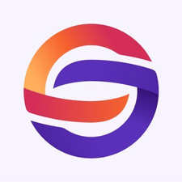
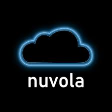

# **トレジャリー**

## **Tokeoの財務投資プログラム**

Tokeoは、**Treasury Rewards Program**（財務報酬プログラム）を開始し、$TOKE保有者にDeFiおよびDePinの機会から得られる報酬への独占的なアクセスを提供します。

Tokeoは、**IDOで調達した資金の最大1/3を投資**し、Cardanoエコシステム内の戦略的成長と革新的なプロジェクトを支援します。

このプログラムは、戦略的パートナーシップと月次報酬メカニズムを組み合わせ、$TOKE保有者に利益を還元します。

## **プログラムの柱**
- **Tokeoプラットフォーム活動による純手数料の25%**
- 高成長の**DeFiおよびDePinプロジェクトとの戦略的パートナーシップ**
- $TOKE保有者向けの、OTCでは入手できない**独占的な投資機会**
- トークン保有とステーキングの**報酬メカニズム**
- コミュニティのガバナンスと透明性

## **報酬パートナーの発表**

- **World Mobile Token**  
  
  革新的なブロックチェーンベースのモバイルネットワークであるWorld Mobile Tokenは、Tokeoと提携し、画期的な投資機会を提供します。この協力により、World Mobileの分散型モバイルインフラの専門知識とTokeoの投資力を結びつけ、$TOKE保有者に変革的な通信エコシステムへのアクセスと魅力的な成長ポテンシャルを提供します。

- **NUVOLA**  
  
  クロスチェーンDePinアグリゲーターおよびクライアントサービスの先駆者であるNUVOLAは、さまざまなDePinの機会から報酬を生み出し、$TOKEの報酬プールに長期的な持続可能な報酬を供給します。

**今後数日で、さらなるパートナーシップと包括的な財務管理戦略についてお知らせいたしますので、ご期待ください。**