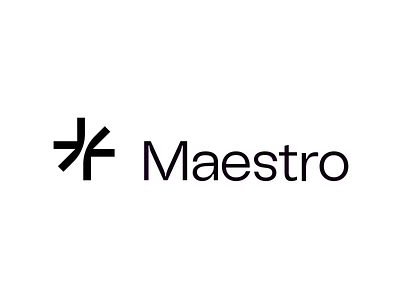

# **Tokeo ISPOとは？**

TokeoのISPO紹介: Cardanoブロックチェーンでの資金調達を革新

Tokeoと共に未来へ踏み出しましょう。TokeoはCardanoブロックチェーンの可能性を最大限に引き出すビジョナリープラットフォームです。従来のブロックチェーン技術とは異なり、Cardanoは独自の機能と高度な特徴を持ち、私たちのプラットフォームに完璧にマッチしています。

Tokeoでは、エコシステムの基盤としてCardanoを戦略的に選び、その強力なインフラを活用してネイティブトークンスワップ、NFTトレーディング、オンチェーンペイメントなどの革新的な機能を実現しています。これらはすべてモバイルデバイスでシームレスにアクセス可能です。私たちの革新への取り組みはCardanoに留まらず、BTCやEVMベースのチェーンとのクロスチェーン相互運用性を目指し、ユーザーの可能性を広げます。

私たちの画期的なInitial Stake Pool Offering (ISPO) は、単なる資金調達にとどまりません。革新を推進し、すべてのステップでコミュニティのエンゲージメントを促進することを目指しています。CardanoのProof of Stake (PoS) システムと連携することで、私たちは新しいDeFiの時代を切り開き、ユーザーが暗号の未来を形作る参加を可能にします。

さらに、Tokeoでは、ADAを売却することなくトークンの価値を高めることができ、成長と投資の多様化のためのユニークな機会を提供します。

私たちと共に、Cardanoの無類のプラットフォームとその先で、モバイル対応のDeFiの基準を再定義しましょう。

## **ISPO詳細**

| 項目      | 詳細                          |
| ----------- | ------------------------------------ |
| ローンチ       | 2024年5月24日（エポック487）  |
| 期間       | 34 エポック |
| 終了    | 2024年11月15日（エポック521） |
| 総報酬    | 10,000,000 $TOKE |
| ISPO 報酬    | 9,000,000 $TOKE |
| ISPO ボーナス   | 1,000,000 $TOKE |

委任状況やプールの飽和度に応じて、ボーナス額を増加させるため、および追加のプールを作成するために、トークンの割り当てを確保しています。

## **ISPOの利点**

* Tokeoはベンチャーキャピタルに依存せずに資金を調達でき、自律性を育み、開発、マーケティング、革新のための支援基盤を拡大します。

* コミットメントのあるコミュニティを育成し、持続的なエンゲージメントと忠誠心を養います。

* 市場での視認性を高め、概念実証として機能し、さらなる関心と投資を引き付けます。

* 分散型の資金調達を受け入れ、Tokeoのブロックチェーン技術へのコミットメントと一致させます。

## **参加者のメリット**

* **金銭的投資なしのサポート:**参加者は、資産の所有権を保持しながらTokeoを支持できるため、直接的な金銭的貢献を必要とせず、財務リスクを軽減できます。

* **報酬メカニズム:**ISPO期間中、従来のステーキング報酬はプロジェクトに向けられますが、参加者はその代わりにプロジェクトトークンを受け取ります。これらのトークンは大幅に価値が上昇する可能性があり、エンゲージメントへの追加のインセンティブを提供します。

* **イノベーションの支援:**参加者はTokeoのような革新的なプロジェクトを支援する機会を持ち、Cardanoコミュニティ内で新しい技術やアイデアの成長を促進する上で重要な役割を果たします。

## **Cardanoへのメリット**

* **ネットワークのセキュリティと回復力の向上**:ISPOはユーザーに対して資産のステーキングを奨励し、これによりCardanoネットワーク全体のセキュリティと回復力を強化します。

* **Cardanoエコシステムへの注目の増加**:ISPOはCardanoエコシステムへの関心を高め、プラットフォーム内での成長と革新を促進します。

* **資金調達のためのPoSメカニズムの実用性**:CardanoのPoSメカニズムの資金調達への実用性は、プラットフォームに多様なプロジェクトやユーザーを引き寄せる可能性があります。

## **ISPOパートナーシップ**
私たちは、Initial Stake Pool Offering (ISPO) においてMaestroとのパートナーシップを発表できることを非常に嬉しく思います。経験豊富なエンジニアチームと革新的なソリューションで知られるMaestroは、スマートコントラクトにおける専門知識を提供し、その中にはMaestro Vesting Smart Contractも含まれています。

この契約は、ホルダーのトークンを厳格なベスティングスケジュールに従ってロックし、トークンの発行を効果的かつ効率的に管理します。

このメカニズムは流動性を促進するだけでなく、ホルダーに対する価値を高め、私たちのプロジェクトの安定的かつ持続可能な成長軌道を確保します。この協力に非常に感謝しており、MaestroがISPOおよびその先に提供する強力なトークン管理ソリューションを心待ちにしています。

