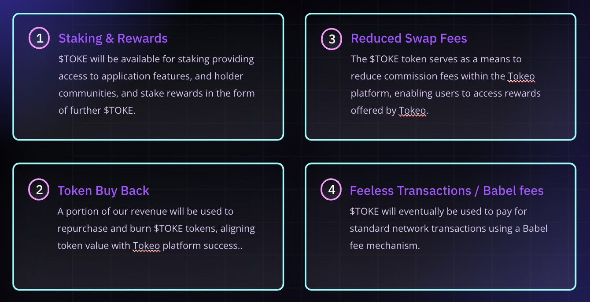

# **ユーティリティ**

## **トークンホルダーへのメリット**
$TOKEホルダーは私たちのエコシステムの最前線に立ち、エクスペリエンスを向上させるために設計された独占的な特典とインセンティブを享受します。

**①ステーキング & リワード**  
$TOKEは、アプリケーション機能へのアクセス、ホルダーコミュニティ、そしてさらなる$TOKEの形でのステーク報酬を提供するステーキングのために利用可能になります。

**②トークンの買い戻し**  
収益の一部を使用して$TOKEトークンを再購入およびバーンし、トケオプラットフォームの成功とトークンの価値を一致させます。

**③スワップ手数料の削減**  
$TOKEトークンは、トケオプラットフォーム内の手数料を削減する手段として機能し、ユーザーがトケオによって提供されるリワードにアクセスできるようにします。

**④手数料なしの取引 / バベル手数料**  
$TOKEは最終的に、バベル手数料メカニズムを使用して標準的なネットワーク取引の支払いに使用されます。

## **手数料の削減**
$TOKEホルダーは優遇措置を受け、Tokeoプラットフォーム内での取引やサービスに対する手数料が割引されます。

## **独占機能へのアクセス**
$TOKEホルダーは、用意された一連の専用機能と特典にアクセスでき、Tokeoでの体験をより豊かなものにすることができます。

## **コミュニティ参加**
Tokeoは、$TOKE保有者がフィードバック、ガバナンス、共同イニシアチブを通じてプラットフォームの未来を形作ることに積極的に参加する活気あるコミュニティを育成しています。

## **ステーキング**
委任者はTokeoの財務実績を共有する機会を得るとともに、プラットフォームの成熟に伴い追加のトークンで報酬を受け取ります。