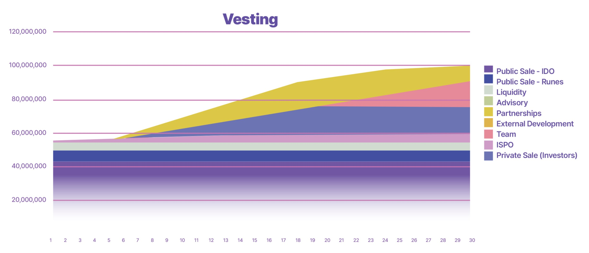

# **権利確定**

Tokeo内のすべてのトークンは、オンチェーンで直接管理される権利確定スケジュールに従います。Maestro管理のスマートコントラクトを活用することで、トークンの権利確定および償還プロセスをシームレスに実装します。

包括的なホルダーダッシュボードを通じて、ユーザーは自身の保有状況を確認できます。ダッシュボードには、総保有量、取引可能なトークン、ベストされたトークン、および対応する利用可能日が表示されます。

## **戦略：**
権利確定はTokeoエコシステム内でのトークン配布の重要な側面であり、プロジェクトの健全性を維持し、すべてのステークホルダーに持続的な価値を提供するために設計されています。

これを達成するために、私たちはプライベートセールの投資家、ISPOの参加者、チーム、戦略的パートナー、アドバイザー、およびマーケティングコラボレーターを含むさまざまなステークホルダーを対象とした、綿密に構築された権利確定スケジュールを実施しました。

## **プライベートセール投資家およびISPO参加者：**
プライベートセール投資家およびISPO参加者に対しては、慎重なアプローチが採用されています。最初に、彼らのトークンの100％は提案されたパブリックセール（IDO）までロックされています。

パブリックセールが開始されると、彼らのトークンの15％がアンロックされ、初期の支援者に流動性を提供します。

しかし、トークンの価値を守り流動性を維持するために、参加者がトークンを12ヶ月間にわたって線形に分散し始める前に、2ヶ月のクリフ期間が設定されています。

この段階的なリリースメカニズムは、市場の急激な変動を防ぎながら、時間をかけて流動性を安定的に増加させるバランスの取れたトークン配布を確保します。

## **チーム割り当て：**
同様に、チームの割り当てにも構造化された権利確定プロセスが適用され、プロジェクトへの長期的なコミットメントを強調しています。

チームのトークンの15％はパブリックセール時にアンロックされますが、彼らの権利確定期間は18ヶ月にわたって延びており、流動性の促進と投資家やトークンホルダーに有利な結果をもたらすための深い献身を示しています。

この延長された権利確定期間は、チームの利益を広範なコミュニティの利益と一致させるだけでなく、トケオの使命とビジョンに対する揺るぎない信念の証ともなります。

## **パートナーシップ、アドバイザリー、およびマーケティングコラボレーター：**
さらに、パートナーシップ、アドバイザリー、およびマーケティングの割り当ても、若干の修正を加えた類似の権利確定スケジュールに従います。

これらの割り当てはパブリックセールの2ヶ月後にベストが開始され、トークンは18ヶ月にわたって分散されます。

この慎重なアプローチにより、戦略的コラボレーターはトケオの成長と成功に積極的に貢献しながら、市場に安定したトークンの流れを確保し、投資家やステークホルダーの信頼を醸成することができます。

全体として、強固な権利確定メカニズムの実施は、トケオエコシステム内での透明性、持続可能性、および永続的な価値の創造へのコミットメントを強調しています。